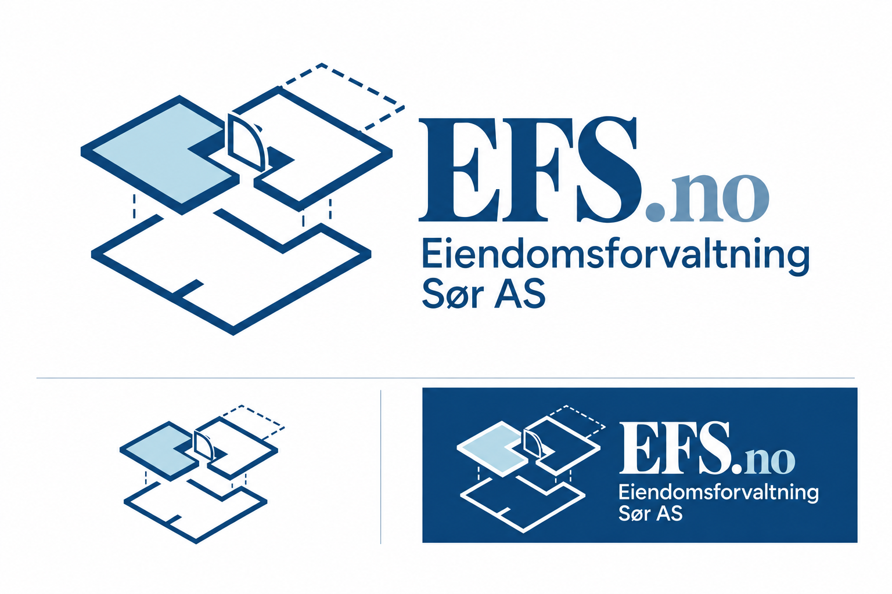

# EFS.no – logoprofil

**Valgt 5. oktober 2026:** forslag 02 «Kraftigere blå» fra serien *EFS.no – dypere blå*. Denne profilen dokumenterer logoen som er valgt for Eiendomsforvaltning Sør AS. Originalbildet er fasit for utforming, proporsjoner og farger.

## Navn og skrivemåte

- Logonavn: **EFS.no** – store bokstaver i EFS, små bokstaver i `.no`.
- Selskapsnavn: **Eiendomsforvaltning Sør AS**. I logoen står navnet på to linjer: «Eiendomsforvaltning» og «Sør AS».
- Nettadresse: [efs.no](https://efs.no).

`.no` er mindre og lysere enn EFS og deler grunnlinje med bokstavene. Det skal oppfattes som en del av ordmerket, ikke som en egen undertittel. Bevar punktum, norsk ø og den valgte linjedelingen.

## Idé og motiv

Merket er inspirert av seksjonering og plantegninger. To adskilte, L-formede arealer i øvre lag gjør oppdelingen synlig. Det lyseblå arealet gir ett av rommene tydelig identitet. En åpnet dør mellom arealene er tegnet med dørblad og svingbue slik man kjenner det fra en plantegning. Et stiplet felt øverst til høyre antyder tilleggsareal eller terrasse. Et åpent plan under og korte, stiplede forbindelser viser at eiendommen kan leses i flere lag.

Dette er en visuell tolkning av motivet, ikke en juridisk seksjoneringstegning. Merket skal uttrykke struktur, oversikt og forståelse av bygget som helhet.

## Farger

| Farge | Referanse | Bruk |
| --- | --- | --- |
| Kraftig, dyp blå | **#0B3F70** | Bestilt hovedfarge for EFS, selskapsnavn og mørke linjer. |
| Isblå | Omtrent **#B7DAE9** i originalbildet | Farget rom; beholdes lys og dempet. |
| Lys blågrå | Omtrent **#6691B3** i originalbildet | `.no`; beholdes lysere enn EFS. |
| Hvit | **#FFFFFF** | Lys bakgrunn og lyse elementer i omvendt variant. |

Hovedfargen #0B3F70 er den uttrykkelige fargebestillingen i genereringsprompten. Det valgte rasterbildet inneholder små fargevariasjoner: den hyppigste mørkeblå pikselen i et utvalg av EFS-ordmerket var #0B457A. De lyse referansene over er også målinger fra avgrensede områder i originalbildet, ikke fastlagte Pantone- eller trykkfarger. Bruk originalfilen uendret på nettsiden. Ved senere vektorisering eller trykkproduksjon bør én ensartet palett godkjennes med dette bildet som visuell referanse.

## Typografi

EFS.no bruker en klassisk serif med tydelig kontrast mellom tykke og tynne streker. Selskapsnavnet bruker en ren sans serif. Kombinasjonen gir et tydelig hovednavn og en rolig, lesbar forklaring.

Logoen ble generert som et rasterbilde. Det finnes derfor ingen identifisert eller lisensiert original fontfil, og et eksakt fontnavn er ikke dokumentert. Bruk ferdig logo som bilde fremfor å skrive den på nytt med en tilfeldig font. Eventuelle fremtidige fontvalg eller vektorreproduksjoner er egne implementeringer som må vurderes mot originalen.

## Varianter og bruk

- **Full logo på lys flate:** symbol, EFS.no og selskapsnavn. Brukes når hele navnet skal være synlig, blant annet i nettsidens topp på større skjermer, meny og bunn.
- **Omvendt logo på mørkeblå flate:** lyse linjer og tekst; rommet og `.no` beholder de lyse blåtonene. Bruk en egen godkjent fil fremfor automatisk fargefilter.
- **Kompakt logo:** symbol sammen med EFS.no brukes i mobilens toppfelt. Et eget symboluttrekk finnes også for små flater; det trenger navneforklaring i nærheten eller tilgjengelig tekst for skjermlesere.

La logoen beholde sideforholdet sitt. Ikke strekk, roter, flytt rommene, endre døren, fjerne stiplingen, bytt farger eller endre størrelsesforholdet mellom EFS og `.no`. Plasser den på en rolig flate med god kontrast. På fotografier kan et lyst, frostet kort brukes som bakgrunn.

En praktisk friplass er minst høyden av den lille `.no`-bokstaven rundt hele logoen. Dette er en anbefaling for denne implementeringen, ikke en eksisterende konstruksjonsregel. Minste størrelse må vurderes ut fra faktisk lesbarhet: selskapsnavnet, døren og de stiplede detaljene skal fortsatt kunne sees. Bruk kompakt variant dersom full logo blir for liten. Endelige pikselmål og testede størrelser dokumenteres sammen med de ferdige nettfilene.

## Filer og leveranse

| Fil | Innhold |
| --- | --- |
| [Original PNG](../assets/efs-logo-02-original.png) | Uendret valgt presentasjonsbilde, 1536 × 1024 piksler. Dette er den visuelle fasiten. |
| [logo-hoved.svg](logo-hoved.svg) | Hele logoen på lys flate, avgrenset fra originalen. |
| [logo-symbol.svg](logo-symbol.svg) | Kun plantegningssymbolet, avgrenset fra originalen. |
| [logo-mobil.svg](logo-mobil.svg) | Originalens symbol og EFS.no ved siden av hverandre, uten selskapsnavnets undertittel. |
| [logo-negativ.svg](logo-negativ.svg) | Originalens lyse logo på mørkeblå bakgrunn. |
| [palett.json](palett.json) | Bestilt hovedfarge og omtrentlige rasterprøver. |
| [manifest.json](manifest.json) | Versjon, kildemål, filbeskrivelser og kontrollsum for originalen. |
| [genereringsbeskrivelser.txt](genereringsbeskrivelser.txt) | Eksakt originalprompt, verktøy og produksjonsmetode. |
| [Profilvisning](index.html) | Enkel visuell oversikt over logoen og leveransen. |

**Filformat:** SVG-filene er visningsrammer med det originale PNG-bildet innebygd. De bevarer originalens piksler og er selvstendige filer, men er ikke redigerbare vektortegninger. De har hvit eller mørkeblå bakgrunn fra originalbildet; de er ikke transparente logooriginaler. For større trykk eller senere redigering er en ekte vektororiginal et eget produksjonssteg.

På nettsiden vises logoen gjennom SVG-utsnitt av én felles PNG, slik at nettleseren laster kildebildet én gang. CSS blander det hvite med den lyse kortflaten. Toppfeltet viser hele logoen på større skjermer og den kompakte varianten ved 520 px og smalere. Meny og bunnfelt viser hele logoen.

Kontrollerte størrelser: full logo omtrent 232 px bred i toppfeltet og inntil 210 px i menyen; bunnlogo 250–270 px. Mobilkortet tilpasser seg fra 143 til 96 px bredde. Dette er nettmål, ikke trykkmål. Hele selskapsnavnet krever mer plass enn det kompakte ordmerket.

## Versjon og tilbakeføring

Versjon: **2026-10-05-logo-02**. Nettsiden før logobyttet ligger i Git-historikken på commit `39c6ce24eb141164670f9c013ebc0fba54d99d66`. Lokal sikkerhetskopi av de tidligere sidefilene er også tatt før endringen.

For å angre kun logobyttet: tilbakefør committen som endret `index.html`, `estate.css` og hoved-README. Profil og kildebilde kan beholdes som arkiv. Ikke nullstill hele repoet dersom nyere endringer skal bevares. GitHub Pages publiserer tilbakeføringen når den lagres i `main`.

## Kildehistorikk

1. **3. oktober 2026 – utforsking:** serien «Favoritter og nye retninger», 13 logoer. Motiv fra nr. 06 *Seksjonene løftes frem*, serif-retning fra nr. 01 *Tydelig tilleggsareal* og lyseblå inspirasjon fra nr. 05 *To etasjer, samme oversikt*.
2. **4. oktober 2026 – kombinasjon:** motiv 06 ble kombinert med serif-retningen og lyseblått rom. Nettadressesuffikset ble først skrevet som EFS.NO.
3. **5. oktober 2026 – ordmerke:** tre varianter med mindre `.no`. Nr. 02 med lys blågrå `.no` ble valgt.
4. **5. oktober 2026 – hovedfarge:** to varianter med dypere blå. Nr. 02 *Kraftigere blå*, bestilt med #0B3F70, er den valgte logoen dokumentert her. Lyseblått rom og blågrå `.no` ble beholdt.

Verktøy: innebygd **imagegen (`image_gen.imagegen`)**. Valgt originalfil: `2026-10-05-efs-no-dypere-bla/02-kraftigere-bla.png`. Direkte bildereferanse ved siste generering: `2026-10-05-efs-no-varianter/02-lys-blagra-no.png`. Den eksakte prompten lagres sammen med logoen. Inspirasjon fra tidligere vedlagte eksempler inngikk i utforskingen; denne profilen dokumenterer ikke en særskilt varemerkeundersøkelse eller et bestemt fontkjøp.

## Virksomhet

Eiendomsforvaltning Sør AS · Org.nr. 980 225 216 · Basert i Kristiansand, oppdrag i hele Norge.

Kontakt: Eivind Hübert Skajaa, daglig leder / konsulent · eivind@skajaa.no · +47 913 24 677.
